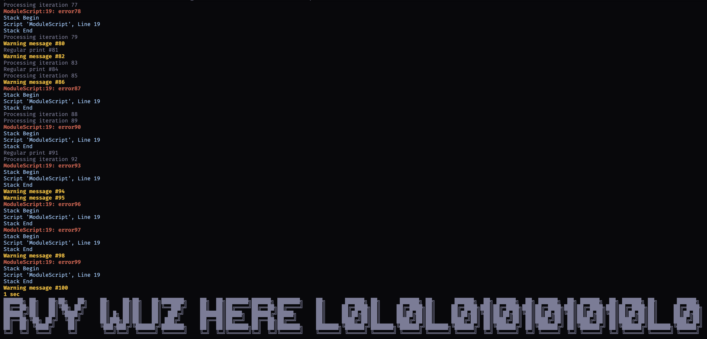

<p align="center">
  
</p>

# rodeo
Provides a roblox studio luau run-time in cli by routing code 
execution to running studio instances via websockets.

## Features
- **Hot-reloaded modules** - Code changes take effect immediately without restarting Studio
- **Color-coded output** - Prints, warnings, and errors appear in your terminal with colors
- **Environment targeting** - Route executions to specific runtime contexts (edit/play, client/server)
- **Log filtering** - Control which log levels are displayed
- **Return values** - Capture script return values via stdout
- **Sourcemap support** - Auto-detects `sourcemap.json` to preserve stack traces
- **Full Studio API** - Scripts have complete access to all Studio APIs

## Installation

### via pesde

```bash
pesde add rvy/rodeo
```

### via mise

```bash
mise use ubi:revvy02/rodeo
```

### via rokit

```bash
rokit add revvy02/rodeo
```

## Usage

### Serve Mode

For running multiple scripts without restarting Studio.

**Setup** (first time only):
```bash
rodeo build
```

**Start server**:
```bash
rodeo serve
```

**Run scripts** (in another terminal):
```bash
# Basic execution
rodeo run script.luau

# Run from .rodeo/ directory
rodeo run mytest              # runs .rodeo/mytest.luau
```

### Once Mode

Execute a script one time. Studio opens temporarily and closes after execution. This is functionally identical to `run-in-roblox`.

```bash
# Basic execution (uses empty place)
rodeo once script.luau

# With place file
rodeo once script.luau --place game.rbxl
```

If `sourcemap.json` exists in the current directory, it will be used automatically to preserve stack traces. You can also specify a custom path with `--sourcemap`.

### Context Targeting

Target specific runtime contexts when using serve mode. Running tests in studio will automatically connect VMs, and `run` will let you target VMs with flags.

```bash
# Run in Studio edit mode only
rodeo run script.luau --studio 1 --running 0

# Run in client only
rodeo run script.luau --client 1

# Run in server only
rodeo run script.luau --server 1

# Exclude edit mode
rodeo run script.luau --edit 0
```

**Available environments:**
- `--studio` - Studio environment
- `--server` - Server runtime
- `--client` - Client runtime
- `--edit` - Edit mode (not running)
- `--running` - Play mode (game running)

Omit a flag to match any value. Use `1` to require it, `0` to exclude it.

### Script Directives

Embed default flags directly in your script files using the `--!rodeo` directive:

```lua
--!rodeo --client 1 --running 1 --context server
print("This runs on client VM in server context")
```

The directive must be on line 1 (or line 2 if there's a shebang). CLI flags override directive defaults:

```bash
# Uses directive defaults
rodeo run script.luau

# Override context from directive
rodeo run script.luau --context plugin
```

### Custom Port Configuration

By default, rodeo uses port 44872 for serve mode and 44873 for once mode. You can customize the port number if needed:

```bash
# Start server on custom port
rodeo serve --port 8080

# Run script on custom port server
rodeo run script.luau --port 8080

# One-time execution on custom port
rodeo once script.luau --port 9000
```

**Available commands with `--port`:**
- `rodeo serve --port <number>` - Start server on custom port (default: 44872)
- `rodeo run --port <number>` - Connect to server on custom port (default: 44872)
- `rodeo once --port <number>` - Run ephemeral server on custom port (default: 44873)

### Output Redirection

Redirect execution output and return values to files:

```bash
# Save execution output (prints/logs) to file
rodeo once script.luau --output output.txt

# Save return value to file
rodeo run script.luau --return result.json

# Save both to different files
rodeo once script.luau --output output.txt --return result.json
```

**Available flags:**
- `--output <path>` - Write execution output (prints/logs) to file instead of stdout
- `--return <path>` - Write return value to file (can be combined with `--show-return`)
- `--show-return` - Print return value to stdout (see [Return Values](#return-values))

### Log Filtering

Control which logs are shown in your terminal:

```bash
# Suppress warnings
rodeo once script.luau --no-warn

# Suppress errors (still sets exit code on error)
rodeo run script.luau --no-error

# Suppress print statements
rodeo once script.luau --no-print

# Suppress all output
rodeo run script.luau --no-output
```

**Available flags:**
- `--no-warn` - Hide warning messages
- `--no-error` - Hide error messages
- `--no-info` - Hide info messages
- `--no-print` - Hide print statements
- `--no-output` - Disable all output (most efficient)

### Return Values

Scripts can return values. By default, return values are silent (not printed), but you can:
- Print them to stdout with `--show-return`
- Save them to a file with `--return <path>`
- Do both simultaneously

```bash
# Print return value to stdout
rodeo once script.luau --show-return

# Save return value to file
rodeo run script.luau --return result.json

# Both: save to file AND print to stdout
rodeo once script.luau --return result.json --show-return

# Capture return value in shell (with --show-return)
result=$(rodeo once script.luau --no-output --show-return)
echo "Result: $result"
```

**Example script:**
```lua
-- Calculate and return a value
local sum = 0
for i = 1, 100 do
    sum = sum + i
end

return { sum = sum, count = 100 }
```

**Output (with `--show-return`):**
```
{"sum":5050,"count":100}
```

Return values are JSON-encoded if possible, otherwise converted to string with `tostring()`.

### Hot-Reloaded Execution

By default, rodeo doesn't cache modules or their dependencies. Every execution reflects the most up-to-date code without needing to restart Studio.

**The problem:** Roblox caches `require()` results, so code changes don't take effect until you restart Studio.

**The solution:** rodeo automatically bypasses Roblox's module cache, ensuring your changes are always reflected.

```bash
# Edit config.luau, utils.luau, or any required modules
# Run your script - changes take effect immediately
rodeo run main.luau

# Edit modules again
# Run again - fresh code every time
rodeo run main.luau
```

This default behavior is ideal for development, ensuring executions always reflect your latest changes.

**Performance optimization:** If you need faster execution and your modules aren't changing, use `--cache-requires` to enable caching:

```bash
# Enable module caching (faster, but changes won't be reflected)
rodeo run script.luau --cache-requires
```

## Output Example
<p align="center">
  
</p>