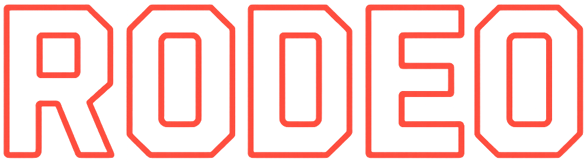

<p align="center">
  
</p>

# rodeo

`rodeo` is an automation tool for Roblox Studio. It lets you execute code in any Studio environment and control Studio from your terminal, while providing the complete studio luau runtime.

> **Status:** macOS is fully supported. Windows and Linux currently are not but are a work-in-progress. Breaking changes to API may happen.

## Install

### via mise

```bash
mise use ubi:revvy02/rodeo
```

### via rokit

```bash
rokit add revvy02/rodeo
```

## Quickstart

```bash
# 1. Install the companion plugin into Studio. (One-time.)
rodeo plugin

# 2. Open Studio (any place). The plugin auto-connects to localhost:44872.

# 3. Start the rodeo server.
rodeo serve

# 4. Run scripts in another terminal.
rodeo run --source 'print("hi from studio")'
```

## Docs

- **[docs/cli.md](docs/cli.md)** — full CLI reference. Every subcommand, targeting (`--target`), directives, log filtering, return values, bundling, FFlags.
- **[docs/api.md](docs/api.md)** — using rodeo programmatically from Luau (Lune / Lute).
- **[docs/runtime.md](docs/runtime.md)** — the `@rodeo/*` runtime library scripts get inside Studio (fs, io, stream, process, roblox).

## Companion tools

- **[rbx-microprofiler](https://github.com/revvy02/rbx-microprofiler)** — view + diff Roblox microprofiler dumps captured via `rodeo run --profile`.
