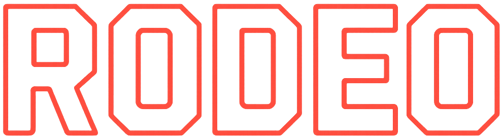

<p align="center">
  
</p>

# rodeo

[](https://github.com/revvy02/rodeo/releases)
[](https://github.com/revvy02/rodeo/releases)

`rodeo` is an automation tool for Roblox Studio. It lets you execute code in any Studio environment and control Studio from your terminal, while providing the complete studio luau runtime.

> **Status:** macOS and Windows are fully supported. Linux currently is not. Breaking changes to API may happen.

## Examples

### Open a place, run a script, close it

`--place` opens a place ID or a local file, runs the script against it, and closes it when done.

```bash
$ rodeo run --place 1234567890 --show-return --source "return game.Workspace.Name"
"Workspace"

$ rodeo run --place ./game.rbxl script.luau

# rodeo opens Studio in the background by default; --focus brings it to the front
$ rodeo run --place ./game.rbxl --focus script.luau
```

### Keep the place open

`--detach` leaves the Studio open after the run.

```bash
$ rodeo serve                 # terminal 1

$ rodeo run --place 1234567890 --detach --source "print('studio is up')"
studio is up

$ rodeo run --show-return --source "return game.PlaceId"
1234567890
```

### Pipe stdio between the terminal and Studio

Scripts read the terminal's stdin and write to its stdout.

```lua
-- greet.luau
local io = require("@rodeo/io")
local stream = require("@rodeo/stream")

local name = stream.read(io.stdin)
stream.write(io.stdout, `hello, {name}\n`)
```

```bash
$ echo "frank" | rodeo run greet.luau
hello, frank
```

### Run code on any DOM, at any identity, in any Studio mode
- `--mode edit|run|test|play`
- `--dom edit|server|client`
- `--context plugin|server|client|elevated`

| Flags | Runs (mode, DOM, identity) |
|-------|----------------------------|
| *(none)* | edit DOM, plugin identity (default) |
| `--context elevated` | edit DOM, command-bar identity |
| `--mode run --context server` | run mode, server DOM, server identity |
| `--mode test --context server` | play test, server DOM, server identity |
| `--mode test --context client` | play test, client DOM, client identity |
| `--mode test --dom edit` | edit DOM, plugin identity, while a play test runs |
| `--mode play --context server` | multiplayer test, server DOM, server identity |
| `--mode play --dom client` | multiplayer test, client DOM, client identity |

A server/client run needs `--mode` — `--context server` alone resolves to edit mode (which has no server DOM) and errors, rather than silently transitioning the studio.

`--context` composes with `--dom-id <id>` to run at a chosen context on one
exact DOM (e.g. `--dom-id <id> --context elevated`). `--dom-id` / `--studio-id`
accept a unique id prefix (from `rodeo state`).

```bash
$ rodeo run --mode run --context server --show-return --source "return game:GetService('RunService'):IsRunning()"
true
```

### Access live module state in a play test

`--mode test --context client` runs at client identity in a play test. Instance requires resolve to the same modules your running game code is using, so you can mutate state in one run and read it back in the next.

```bash
$ rodeo run --mode test --context client --source '
local m = require(game.ReplicatedStorage.Counter)
m.value += 1
print("value is now", m.value)'
value is now 1

$ rodeo run --mode test --context client --show-return --source "return require(game.ReplicatedStorage.Counter).value"
1
```

Pass `--reload-requires` for the opposite: rodeo re-evaluates the require tree so the run gets its own freshly-initialized copies, isolated from the game's state.

### Export and import models

```bash
$ rodeo run --source '
local roblox = require("@rodeo/roblox")
roblox.export("map.rbxm", { workspace.Map })'

$ rodeo run --source '
local roblox = require("@rodeo/roblox")
local roots = roblox.import("map.rbxm")
print(roots[1].ClassName, roots[1].Name)'
Model Map
```

### Bake data into your source tree

`roblox.bake` writes a value to a `.luau` module. Roblox types round-trip through their constructors, so the file is valid Luau you can `require` from other code — this is how you precompute runtime-only data (animation lengths, generated lookup tables) and commit it.

```bash
$ rodeo run --source '
local roblox = require("@rodeo/roblox")
roblox.bake("dump.luau", { coins = 120, spawn = workspace.Map.Spawn.Position })'
```

```lua
-- dump.luau
return {
	["coins"] = 120,
	["spawn"] = vector.create(0, 5, 0),
}
```

`--return dump.luau` does the same for a script's return value, once, when the run ends. A `--return` path that doesn't end in `.luau` is written as JSON.

## State

`rodeo state` shows what's connected right now as tables joined by a short studio id: the studios split by origin, their DOMs, and the runs executing on them.

```bash
$ rodeo state
LOCAL
 ID        MODE  SOURCE_PATH    WORKING_PATH                    STATUS
 68298c7b  edit  ./MyGame.rbxl  .rodeo/.temp/rodeo-<uuid>.rbxl  connected

UPLOADED
 ID        MODE  PLACE           STATUS
 9aec44bb  test  Place1 (12345)  connected

DOMS
 ID        KIND    STUDIO    USER
 2a32ef67  edit    9aec44bb  -
 f37d718d  server  9aec44bb  -
 b8f11a11  client  9aec44bb  revvy02 (902015375)

RUNS
 ID            STATE    MODE  KIND    CONTEXT  DOM       STUDIO
 b0ec4d9a103b  running  test  client  client   b8f11a11  9aec44bb
```

- **LOCAL**: Studios opened from a place file, showing the file you asked for and the working copy Studio actually has open.
- **UPLOADED**: Studios opened from a place id.
- **DOMS**: one row per DataModel, linked to its studio. Client DOMs show the player.
- **RUNS**: each run joined to the DOM and studio it runs on, with its resolved route.

Scope a run to a studio with `--studio-id <id>`. `rodeo kill <id>` takes either a run id or a studio id, and `rodeo save <studio-id>` commits a Studio's place back to its source file. Ids change each launch, so read them from `rodeo state` rather than hardcoding. Add `--json` for the raw snapshot.

## Docs

**[revvy02.github.io/rodeo](https://revvy02.github.io/rodeo/)**

- [CLI reference](https://revvy02.github.io/rodeo/cli/)
- [@rodeo standard library](https://revvy02.github.io/rodeo/runtime/)

## Companion tools

- **[rbx-microprofiler](https://github.com/revvy02/rbx-microprofiler)** — view + diff Roblox microprofiler dumps captured via `rodeo run --profile`.

## Agentic workflows

rodeo is a CLI first tool. Coding agents are trained heavily on the terminal, e.g. spawning processes, piping stdio, running several at once, and rodeo is a Roblox Luau runtime built to be driven that way. `rodeo run` behaves like any other language runtime: it reads stdin, streams stdout as the script runs, takes arguments, returns a value, and exits with a status code. An agent can start many runs at once, keep long-lived ones in the background, and compose them with ordinary shell tooling.

This is the direction Anthropic points to in [Code execution with MCP](https://www.anthropic.com/engineering/code-execution-with-mcp): calling tools one at a time — each a round trip that loads definitions up front and passes every intermediate result back through the model's context — doesn't scale, while having the model write and execute code instead is faster and dramatically cheaper (they measure up to ~98% less context overhead). A tool call blocks the agent loop until it returns; a process the agent launches keeps running concurrently and streams as it goes. `rodeo` is that process: the complete Studio runtime, in every execution context, behind a single command.
